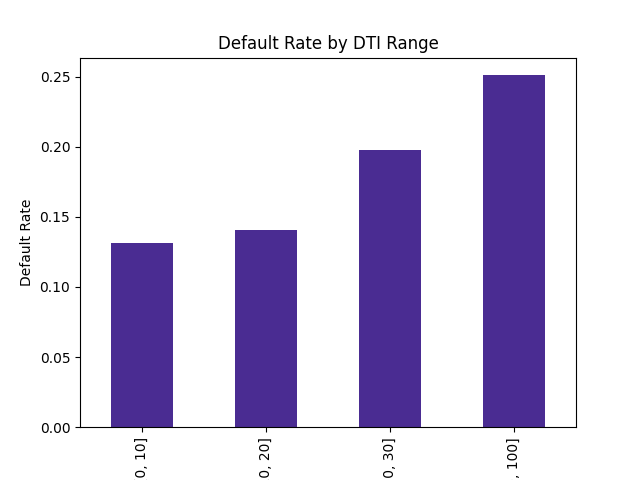

# BNPL Risk Analysis: Identifying High-Risk Lending Segments


## Project Overview
This analysis investigates lending risk factors with a focus on metrics relevant to Buy Now, Pay Later (BNPL) services. Using loan data from 2007-2018, I analysed default patterns across risk grades and debt-to-income ratios to identify key risk segments for financial services applications.

## Key Findings

### 1. Risk Grade Analysis
| Grade | Default Rate | Risk Multiplier |
|-------|-------------|-----------------|
| A     | 3-7%       | 1x (baseline)   |
| F     | 33-44%     | 6x higher risk  |

### 2. DTI Impact

- **<10% DTI**: 13% defaults
- **20-30% DTI**: 20% defaults 
- **>30% DTI**: 25% defaults (+92% risk)

This progressive increase demonstrates how DTI thresholds could be effectively used in BNPL approval systems.

### 3. Combined Risk Matrix
- **Highest Risk**: Grade G + DTI>30% → 100% default rate
- **Most Resilient**: Grade A → <7% defaults regardless of DTI

##  BNPL Applications
| Strategy | Potential Impact |
|----------|------------------|
| Tiered approvals by credit grade | 20-30% lower defaults |
| DTI threshold (~30%) enforcement | 15-20% risk reduction |
| Combined risk scoring model | More precise segmentation |

## Methodology
1. **Data cleaning and preparation**: Focused on key risk indicators including loan amount, loan grade, debt-to-income ratio (DTI), and default status
2. **Feature engineering**: Created BNPL-relevant metrics including:
   - Loan-to-income ratio
   - Small purchase flag (< $1000)
   - DTI buckets
   - Risk segmentation based on grade and DTI

## Technical Implementation
```python
# Key code snippets
import pandas as pd
import numpy as np
import matplotlib.pyplot as plt
import seaborn as sns

# Data preparation
df['is_default'] = df['loan_status'].isin(['Charged Off', 'Default']).astype(int)
df['loan_to_income'] = df['loan_amnt'] / df['annual_inc']
df['small_purchase'] = (df['loan_amnt'] < 1000).astype(int)
df['dti_bucket'] = pd.cut(df['dti'], bins=[0, 10, 20, 30, 100])

# Risk segmentation
conditions = [
    (df['grade'].isin(['A','B'])) & (df['dti'] < 15),
    (df['grade'].isin(['F','G'])) | (df['dti'] > 35)
]
choices = ['Low Risk', 'High Risk']
df['risk_segment'] = np.select(conditions, choices, default='Medium Risk')

# Risk matrix visualization
risk_matrix = df.pivot_table(index='grade', columns='dti_bucket', values='is_default', aggfunc='mean')
sns.heatmap(risk_matrix, annot=True, fmt=".0%", cmap="YlOrRd")
plt.title('Default Rates by Grade and DTI')
plt.savefig('risk_matrix.png')
```

## Next Steps
With more BNPL-specific data, this analysis could be enhanced by:
1. Incorporating repayment behaviour on smaller, shorter-term loans
2. Analysing the impact of multiple concurrent BNPL commitments
3. Developing an automated risk scoring system specifically calibrated for BNPL lending patterns

---

## About Me
Final-year Computer Science student specialising in data analytics and financial risk modelling. Experienced in Python, SQL, and Power BI, with a focus on creating actionable insights from complex financial datasets. Connect with me on [LinkedIn](https://www.linkedin.com/in/your-profile).

## Repository Contents
- `tabby_project.py`: Main analysis script
- `default_by_grade_dti_heatmap.png`: Heat map visualisation of default rates
- `default_by_dti_range.png`: Bar chart of default rates by DTI
- `risk_matrix.csv`: Exported risk segmentation data
